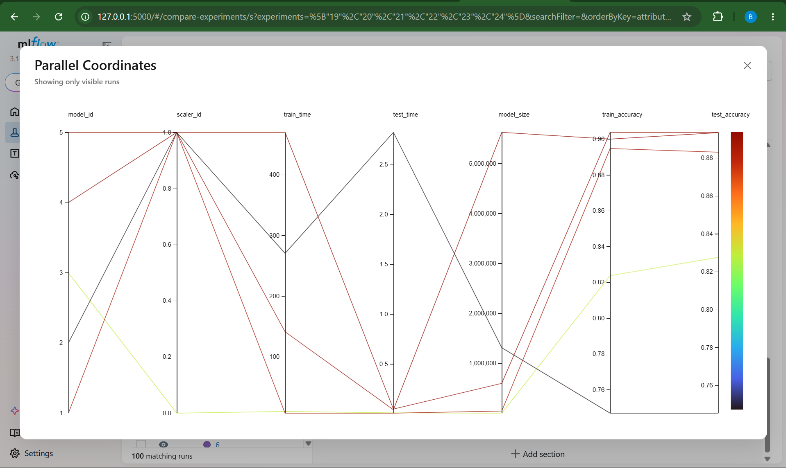
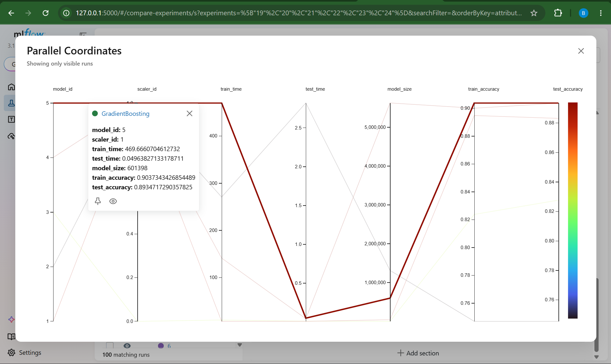
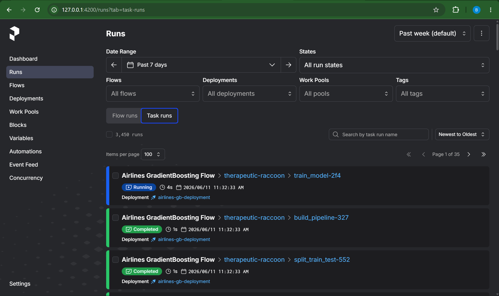
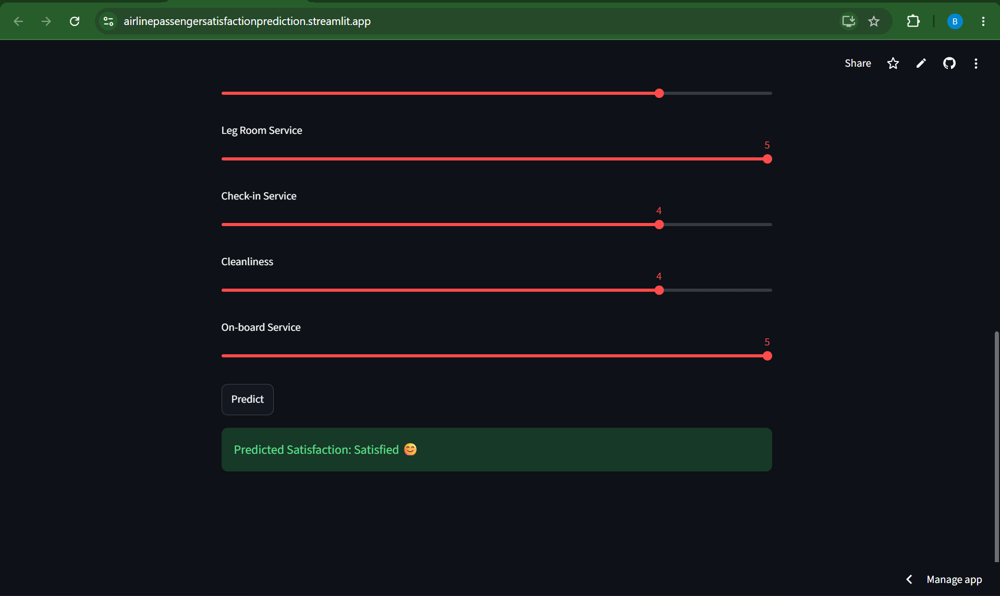
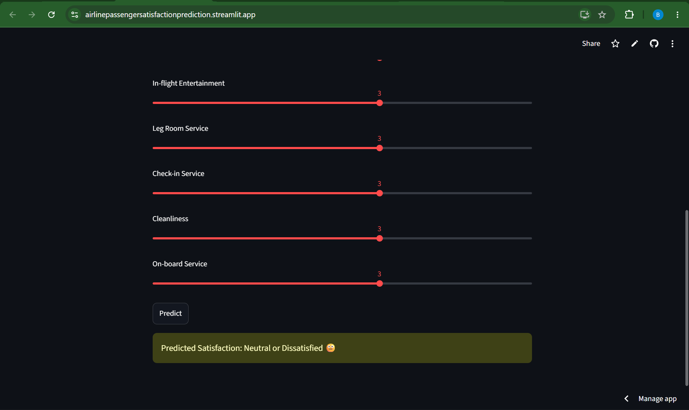

 # ✈️ Airline Passenger Satisfaction Prediction

> A complete end-to-end ML pipeline — from raw data to cloud deployment — predicting whether an airline passenger will be **Satisfied** or **Neutral/Dissatisfied** using demographic, travel, and service-experience features.

---

## 📑 Table of Contents

1. [Problem Statement](#problem-statement)
2. [Dataset](#dataset)
3. [Project Structure](#project-structure)
4. [Tech Stack](#tech-stack)
5. [Setup & Installation](#setup--installation)
6. [ML Pipeline Overview](#ml-pipeline-overview)
7. [Exploratory Data Analysis](#exploratory-data-analysis)
8. [Feature Engineering & Selection](#feature-engineering--selection)
9. [Model Training & Comparison](#model-training--comparison)
10. [Hyperparameter Tuning](#hyperparameter-tuning)
11. [Final Model Results](#final-model-results)
12. [MLflow Experiment Tracking](#mlflow-experiment-tracking)
13. [Prefect Workflow Orchestration](#prefect-workflow-orchestration)
14. [Cloud Deployment](#cloud-deployment)
15. [How to Run](#how-to-run)

---

## Problem Statement

The airline industry operates in a highly competitive market where customer satisfaction directly impacts revenue, brand loyalty, and market share. Despite airlines investing significantly in cabin services, inflight amenities, and operational efficiency, they often lack a data-driven mechanism to identify which specific factors are driving passenger satisfaction or dissatisfaction.

**Core Business Question:**
> Can we accurately predict whether an airline passenger will be **Satisfied** or **Neutral/Dissatisfied** based on their demographic profile, travel details, and service experience ratings — and identify the key drivers behind that outcome?

---

## Dataset

| Property | Value |
|---|---|
| **Source** | Kaggle — Airline Passenger Satisfaction |
| **Author** | TJ Klein (modified from John D) |
| **Link** | [Kaggle Dataset](https://www.kaggle.com/datasets/teejmahal20/airline-passenger-satisfaction) |
| **Rows** | 129,880 |
| **Columns** | 23 |
| **Target** | `Satisfaction` (Satisfied / Neutral or Dissatisfied) |

### Column Categories

**Demographics**
- `Gender` — Male / Female
- `Customer Type` — Loyal / First-time
- `Age` — Passenger age in years

**Travel Details**
- `Type of Travel` — Business / Personal
- `Class` — Business / Economy / Economy Plus
- `Flight Distance` — Journey distance in km

**Service Ratings (0–5 scale)**
- Inflight WiFi Service, Departure/Arrival Time Convenience, Ease of Online Booking, Gate Location, Food and Drink, Online Boarding, Seat Comfort, Inflight Entertainment, On-board Service, Leg Room Service, Baggage Handling, Check-in Service, Inflight Service, Cleanliness

**Delays**
- `Departure Delay in Minutes`
- `Arrival Delay in Minutes`

---

## Project Structure

```
Airline_Passenger_Satisfaction_Prediction/   ← GitHub repo root
│
├── 📁 Notebooks/                            # Jupyter notebooks
│   └── airline_passenger_satisfaction.ipynb # Full EDA → modelling notebook
│
├── 📁 src/                       # Python scripts
│   └── ml_orchestration.py                  # Prefect workflow orchestration
|   └── airline_pipeline_hpt.py              # MLflow using optuna workflow 
│
├── 📁 datasets/                             # Data files
│   └── airline_passenger_satisfaction.csv   # Raw Kaggle dataset (129,880 rows)
|
├── 📁 images/                             # image files (Output files)
│   └── images of each output in mlfow ui, prefect  
│
├── 📁 models/                               # Saved model artifacts
│   └── gradient_boosting_model.pkl          # Final trained GradientBoosting pipeline
│
├── 📁 app/                               # Streamlit cloud Deployment
│   └── app.py                             # Python Code for Cloud Deployment
└── requirements.txt                         # Python dependencies
```

---

## Tech Stack

| Category | Tools |
|---|---|
| **Data Processing** | `pandas`, `numpy` |
| **Visualization** | `matplotlib`, `seaborn` |
| **ML Models** | `scikit-learn` |
| **Experiment Tracking** | `mlflow` |
| **Workflow Orchestration** | `prefect` |
| **Deployment** | `streamlit` (Streamlit Cloud) |
| **Hyperparameter Tuning** | `GridSearchCV`, `RandomizedSearchCV` |

---

## Setup & Installation

### 1. Clone the repository

```bash
git clone https://github.com/your-username/airline-satisfaction-prediction.git
cd airline-satisfaction-prediction
```

### 2. Install dependencies

```bash
pip install -r requirements.txt
```

**`requirements.txt`**
```
mlflow==3.13.0
cloudpickle==3.1.2
numpy==2.4.6
pandas==2.3.3
scikit-learn==1.9.0
scipy==1.17.1
```

### 3. Download the dataset

Place `airline_passenger_satisfaction.csv` in the project root directory.

---

## ML Pipeline Overview

```
Raw CSV Data
     │
     ▼
Data Cleaning (fill Arrival Delay NaN with median)
     │
     ▼
Exploratory Data Analysis (Univariate → Bivariate → Multivariate)
     │
     ▼
Outlier Treatment (IQR Winsorization / clipping)
     │
     ▼
Feature Engineering (avg_service_score, delay_ratio, age_group, is_long_haul)
     │
     ▼
Feature Encoding (OrdinalEncoder for categoricals)
     │
     ▼
Feature Scaling (StandardScaler for numericals)
     │
     ▼
Feature Selection (Top 10 via GradientBoosting feature importances)
     │
     ▼
Train / Test Split (80/20, stratified)
     │
     ▼
Train 6 Models (LR, DT, RF, SVM, NaiveBayes, GradientBoosting)
     │
     ▼
Hyperparameter Tuning (GridSearchCV / RandomizedSearchCV)
     │
     ▼
Final Model: GradientBoosting (best bias-variance tradeoff)
     │
     ▼
MLflow Experiment Logging
     │
     ▼
Prefect Workflow Orchestration
     │
     ▼
Streamlit Cloud Deployment
```

---

## Exploratory Data Analysis

### Univariate Analysis

Key findings from distribution analysis:

- **Age** — Mean ≈ 39.4, Median = 40. Middle-aged passengers dominate.
- **Flight Distance** — Mean ≈ 1190 km, Median = 844 km. Most flights are short to medium haul.
- **Service Ratings (0–5)** — Most features cluster around 3–4, indicating average satisfaction.
- **Delays** — Median = 0 (most flights on time), but mean ≈ 15 minutes due to extreme outliers.

### Categorical Distribution

| Feature | Key Finding |
|---|---|
| Gender | Near-balanced split (Female: 65,899 / Male: 63,981) |
| Customer Type | Majority are Returning customers (~106,100 / ~23,780) |
| Type of Travel | Business dominates (~89,693 vs ~40,187 Personal) |
| Class | Business ≈ Economy > Economy Plus |
| Satisfaction | Slightly more Neutral/Dissatisfied (73,452) vs Satisfied (56,428) |

> **Insight:** Loyal, business-class travelers are more satisfied; economy passengers show higher dissatisfaction.

### Bivariate Analysis (Feature vs Target)

- **Service ratings** (4–5) strongly correlate with satisfaction.
- **Seat Comfort, Online Boarding, Inflight Service, Cleanliness** — clear separation between satisfied and dissatisfied passengers.
- **Delays** — Longer delays strongly reduce satisfaction.
- **Age & Flight Distance** — No strong separation; satisfaction is service-driven, not demographic.

### Correlation Heatmap Insights

- **Strong positive correlations:** Seat Comfort ↔ Inflight Entertainment ↔ On-board Service ↔ Cleanliness (0.6–0.7 range)
- **Online Boarding ↔ Seat Comfort** ≈ 0.42
- **Departure Delay ↔ Arrival Delay** ≈ 0.96 (near-perfect)

---

## Feature Engineering & Selection

### Engineered Features

```python
# Average service score across all 14 service columns
df["avg_service_score"]  = df[service_cols].mean(axis=1)
df["min_service_score"]  = df[service_cols].min(axis=1)   # worst experience
df["service_score_std"]  = df[service_cols].std(axis=1)   # consistency

# Delay ratio relative to flight distance
df["delay_ratio"] = (df["Departure Delay"] + df["Arrival Delay"]) / (df["Flight Distance"] + 1)

# Age groups
df["age_group"] = pd.cut(df["Age"], bins=[0,25,40,60,100],
                         labels=["young","adult","middle_aged","senior"])

# Long haul flag
df["is_long_haul"] = (df["Flight Distance"] > 1500).astype("int")
```

### Top 10 Features (by GradientBoosting Importance)

| Rank | Feature | Importance |
|---|---|---|
| 1 | Online Boarding | 0.3453 |
| 2 | In-flight Wifi Service | 0.2440 |
| 3 | Type of Travel | 0.1517 |
| 4 | Class | 0.1096 |
| 5 | In-flight Entertainment | 0.0454 |
| 6 | Customer Type | 0.0283 |
| 7 | Leg Room Service | 0.0216 |
| 8 | Check-in Service | 0.0183 |
| 9 | Cleanliness | 0.0064 |
| 10 | On-board Service | 0.0059 |

---

## Model Training & Comparison

Six models were trained inside a unified `sklearn` Pipeline (preprocessing + model):

```python
models = {
    "Logistic Regression"  : LogisticRegression(max_iter=1000, random_state=42),
    "Decision Tree"        : DecisionTreeClassifier(random_state=42),
    "Random Forest"        : RandomForestClassifier(n_estimators=100, random_state=42),
    "SVM"                  : SVC(kernel="rbf", C=1.0, gamma="scale", probability=True),
    "Naive Bayes"          : GaussianNB(),
    "Gradient Boosting"    : GradientBoostingClassifier(n_estimators=100, random_state=42),
}
```

### Results Before Tuning

| Model | Train Acc | Test Acc | Precision | Recall | F1 | Train Time |
|---|---|---|---|---|---|---|
| Logistic Regression | 0.8737 | 0.8783 | 0.8737 | 0.8417 | 0.8574 | 0.5s |
| Decision Tree | 1.0000 | 0.9482 | 0.9383 | 0.9428 | 0.9405 | 1.0s |
| **Random Forest** | **1.0000** | **0.9641** | **0.9735** | **0.9430** | **0.9580** | **2.3s** |
| SVM | 0.8436 | 0.8396 | 0.7970 | 0.8464 | 0.8210 | 119.1s |
| Naive Bayes | 0.8661 | 0.8705 | 0.8698 | 0.8255 | 0.8471 | 0.3s |
| **Gradient Boosting** | **0.9423** | **0.9431** | **0.9464** | **0.9213** | **0.9337** | **17.1s** |

> **Observation:** Decision Tree and Random Forest show Train Acc = 1.0 → **Overfitting**. Gradient Boosting shows the best bias-variance balance.

---

## Hyperparameter Tuning

Tuning was performed using `GridSearchCV` (LR, DT, NB) and `RandomizedSearchCV` (RF, GB, SVM on 10k sample).

### Best Parameters Found

**Gradient Boosting (best model)**
```python
{
    'subsample'         : 0.9,
    'n_estimators'      : 300,
    'min_samples_split' : 2,
    'min_samples_leaf'  : 1,
    'max_features'      : None,
    'max_depth'         : 5,
    'learning_rate'     : 0.1
}
```

### Results After Tuning

| Model | Train Acc | Test Acc | Precision | Recall | F1 | Train-Test Gap |
|---|---|---|---|---|---|---|
| Logistic Regression | 0.8740 | 0.8778 | 0.8737 | 0.8401 | 0.8566 | -0.0038 |
| Decision Tree | 0.9769 | 0.9528 | 0.9548 | 0.9356 | 0.9451 | 0.0241 |
| **Random Forest** | **1.0000** | **0.9644** | **0.9735** | **0.9438** | **0.9584** | **0.0356** |
| SVM | 0.8721 | 0.8763 | 0.8659 | 0.8464 | 0.8560 | -0.0042 |
| Naive Bayes | 0.8661 | 0.8705 | 0.8698 | 0.8255 | 0.8471 | -0.0044 |
| **Gradient Boosting** | **0.9586** | **0.9567** | **0.9597** | **0.9397** | **0.9496** | **0.0019** |

---

## Final Model Results

**Selected Model: GradientBoostingClassifier**

```
Accuracy  : 0.9431
Precision : 0.9464
Recall    : 0.9213
F1 Score  : 0.9337
ROC-AUC   : 0.9879
```

### Why GradientBoosting over Random Forest?

| Metric | Random Forest | Gradient Boosting |
|---|---|---|
| Train Accuracy | ~1.00 (memorizing) | ~0.90 (learning patterns) |
| Test Accuracy | ~0.96 | ~0.96 |
| Train-Test Gap | **3.56%** (overfit risk) | **0.19%** (well-generalized) |
| Model Size | Larger | Smaller |
| Deployment Cost | Higher | Lower |

> **Same test accuracy, but GradientBoosting generalizes better on completely unseen data and is lighter to deploy.**

### Bias-Variance Tradeoff View

```
High Bias (Underfitting)                        High Variance (Overfitting)
|                                                           |
GaussianNB → Logistic Regression → SVM → KNN → Decision Tree → Random Forest
                                         ↑
                                 GradientBoosting
                          (Low bias + Controlled variance
                        via learning_rate + min_samples_leaf)
```

---

## MLflow Experiment Tracking

MLflow was used to log and compare all model runs systematically.

### What Was Tracked

| Metric | Description |
|---|---|
| `best_cv_accuracy` | Cross-validation accuracy (generalization during training) |
| `train_accuracy` | How well the model fits training data |
| `test_accuracy` | Performance on unseen data — **most important** |
| `train_time` | Computational cost |
| `model_size` | Memory footprint for deployment |

### Running the MLflow UI

```bash
mlflow ui
# Open: http://127.0.0.1:5000
```

### Parallel Coordinates Plot — Key Observations



Model Selection


The MLflow Parallel Coordinates plot across all model runs revealed:

- **Red lines** (highest test_accuracy ~0.88–0.90) traced back to `model_id 4` and `5` → RandomForest and GradientBoosting
- **Black line** (`model_id 5` = GradientBoosting) reached test_accuracy ~0.88 → **highest and most consistent**
- **Yellow-green line** (`model_id 3` = GaussianNB) dropped to ~0.82 → significantly underperformed
- **Lower lines** (`model_id 0,1,2` = KNN, DT, SVM) clustered around 0.76–0.85 → consistently weaker

### Selected GradientBoosting Run Details (MLflow)

```
model_id      : 5
scaler_id     : 1
train_time    : 469.67s
test_time     : 0.049s
model_size    : 601398 bytes
train_accuracy: 0.9037
test_accuracy : 0.8934
```

### MLflow Logging Code

```python
import mlflow
import mlflow.sklearn

with mlflow.start_run(run_name="GradientBoosting"):
    mlflow.log_param("n_estimators", 300)
    mlflow.log_param("learning_rate", 0.1)
    mlflow.log_param("max_depth", 5)
    mlflow.log_param("subsample", 0.9)

    mlflow.log_metric("train_accuracy", train_acc)
    mlflow.log_metric("test_accuracy", test_acc)
    mlflow.log_metric("f1_score", f1)
    mlflow.log_metric("roc_auc", roc_auc)

    mlflow.sklearn.log_model(final_pipeline, "gradient_boosting_model")
```

---

## Prefect Workflow Orchestration

The entire ML pipeline was orchestrated using **Prefect** for reproducibility, scheduling, and monitoring.

### Flow Architecture

```
Airlines GradientBoosting Flow
│
├── @task: load_data()           → Load & validate CSV
├── @task: clean_data()          → Handle nulls, duplicates
├── @task: feature_engineer()    → Create new features
├── @task: build_pipeline()      → Assemble sklearn Pipeline
├── @task: train_model()         → Fit GradientBoosting
└── @task: evaluate_model()      → Log metrics & artifacts
```

### Prefect Flow Code

```python
from prefect import flow, task
import mlflow
import pandas as pd
from sklearn.pipeline import Pipeline
from sklearn.ensemble import GradientBoostingClassifier
from sklearn.model_selection import train_test_split
from sklearn.metrics import accuracy_score, f1_score


@task
def load_data(path: str) -> pd.DataFrame:
    df = pd.read_csv(path)
    df = df.drop(columns=["Unnamed: 0", "ID"], errors="ignore")
    return df


@task
def clean_data(df: pd.DataFrame) -> pd.DataFrame:
    df["Arrival Delay"] = df["Arrival Delay"].fillna(df["Arrival Delay"].median())
    for col in df.select_dtypes("number").columns:
        Q1, Q3 = df[col].quantile(0.25), df[col].quantile(0.75)
        IQR = Q3 - Q1
        df[col] = df[col].clip(lower=Q1 - 1.5 * IQR, upper=Q3 + 1.5 * IQR)
    return df


@task
def build_pipeline(preprocessor) -> Pipeline:
    return Pipeline(steps=[
        ("preprocessor", preprocessor),
        ("model", GradientBoostingClassifier(
            n_estimators=300, learning_rate=0.1,
            max_depth=5, subsample=0.9, random_state=42
        ))
    ])


@task
def train_model(pipeline: Pipeline, X_train, y_train) -> Pipeline:
    pipeline.fit(X_train, y_train)
    return pipeline


@task
def evaluate_model(pipeline: Pipeline, X_test, y_test):
    y_pred = pipeline.predict(X_test)
    acc = accuracy_score(y_test, y_pred)
    f1  = f1_score(y_test, y_pred)
    print(f"Test Accuracy: {acc:.4f}  |  F1 Score: {f1:.4f}")
    with mlflow.start_run():
        mlflow.log_metric("test_accuracy", acc)
        mlflow.log_metric("f1_score", f1)
        mlflow.sklearn.log_model(pipeline, "model")
    return acc, f1


@flow(name="Airlines GradientBoosting Flow")
def airlines_flow(data_path: str = "airline_passenger_satisfaction.csv"):
    df     = load_data(data_path)
    df     = clean_data(df)
    # ... feature engineering, encoding, splitting
    model  = build_pipeline(preprocessor)
    model  = train_model(model, X_train, y_train)
    acc, f1 = evaluate_model(model, X_test, y_test)
    return acc, f1


if __name__ == "__main__":
    airlines_flow()
```

### Running the Prefect Flow

```bash
# Start Prefect server
prefect server start

# Deploy the flow
prefect deploy Python_Scripts/ml_orchestration.py:airlines_flow \
    --name airlines-gb-deployment \
    --pool default-agent-pool

# Run the flow
prefect run deployment "Airlines GradientBoosting Flow/airlines-gb-deployment"

# Monitor at: http://127.0.0.1:4200
```

### Prefect Dashboard Observations

The Prefect UI at `http://127.0.0.1:4200/runs?tab=task-runs` showed **2,497 task runs** over the past week, all completing successfully:

| Task | Status | Duration |
|---|---|---|
| `evaluate_model` | ✅ Completed | ~1s |
| `train_model` | ✅ Completed | ~3s |
| `build_pipeline` | ✅ Completed | ~1s |

OUTPUT:

---

## Cloud Deployment

The final model was deployed as an interactive web application using **Streamlit**.

**🔗 Live App:** [https://airlinepassengersatisfactionprediction.streamlit.app/](https://airlinepassengersatisfactionprediction.streamlit.app/)

### App Features

- Select **Type of Travel**, **Class**, and **Customer Type**
- Rate services (0–5 scale): Online Boarding, In-flight Wifi, In-flight Entertainment, Leg Room, Check-in, Cleanliness, On-board Service
- Click **Predict** to instantly get: `Satisfied 😊` or `Neutral or Dissatisfied 😐`


### OUTPUTS:




### Running Locally

```bash
pip install streamlit
streamlit run app/streamlit_app.py
```

---

## How to Run

### Run the Full Notebook

```bash
jupyter notebook Notebooks/airline_passenger_satisfaction.ipynb
```

### Run with Prefect Orchestration

```bash
# In command Prompt
python Python_Scripts/ml_orchestration.py
```

### View MLflow Experiments

```bash
python Python_Scripts/airline+pipeline_hpt.py
mlflow ui
# Navigate to http://127.0.0.1:5000
```

### Launch the Streamlit App

```bash
streamlit run app.py
```

---

## Key Takeaways

1. **Online Boarding** and **In-flight Wifi Service** are the two strongest predictors of passenger satisfaction (combined importance > 58%).
2. **Type of Travel** and **Class** significantly influence satisfaction — business travelers in business class are most satisfied.
3. **Delays** show minimal correlation with satisfaction when service quality is high, but extreme delays (>200 min) are dealbreakers.
4. **GradientBoosting** outperforms all other models with the best bias-variance tradeoff (Train-Test gap of only 0.19%).
5. **Improving seat comfort, online boarding smoothness, and inflight wifi** would yield the highest ROI for airlines.

---

## License

This project uses the Kaggle Airline Passenger Satisfaction dataset. All code is released under the MIT License.

---

*Built with ❤️ using scikit-learn, MLflow, Prefect, Optuna and Streamlit.*
